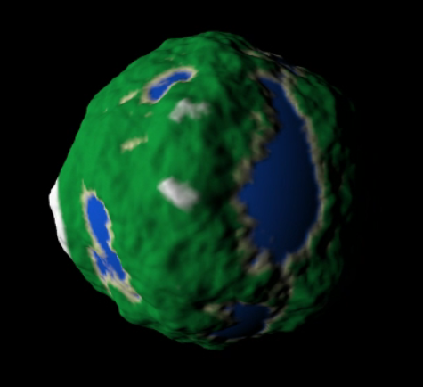

# Planets!

Generate your own custom planet, using your own input parameters:



## Running

1. Download this repository and extract to a folder of your choice

2. In a command prompt:

   ```
   > npm install
   > npm install wasm-pack
   > npm start
   ```

3. Navigate to [http://localhost:8080](http://localhost:8080)


